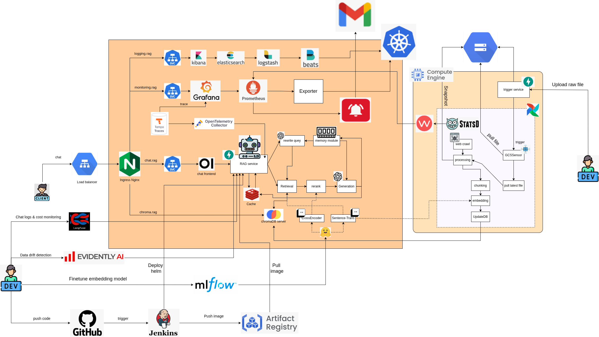
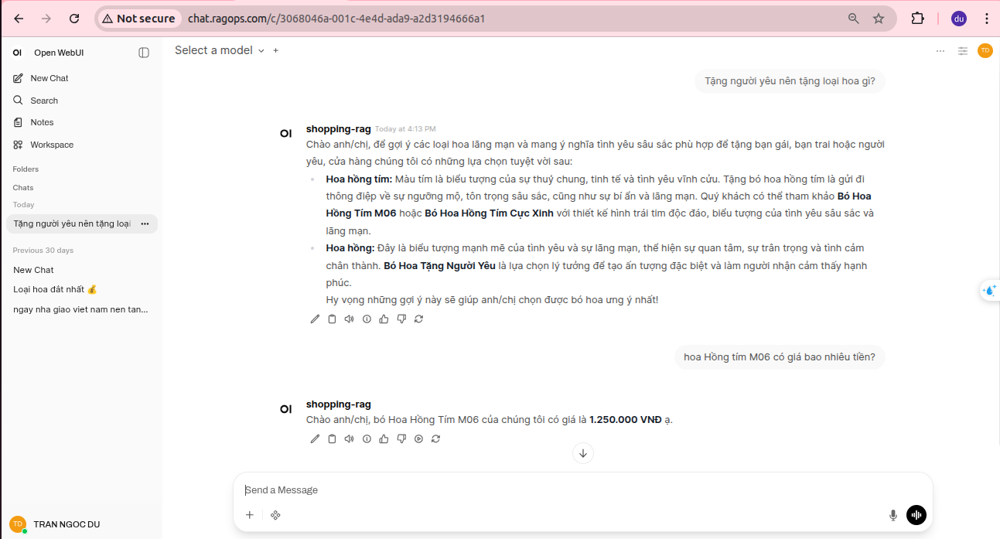
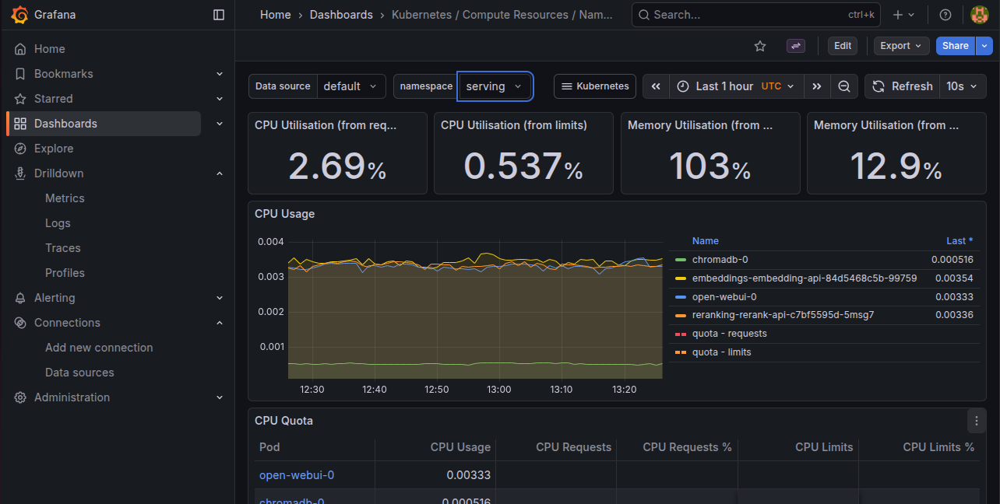
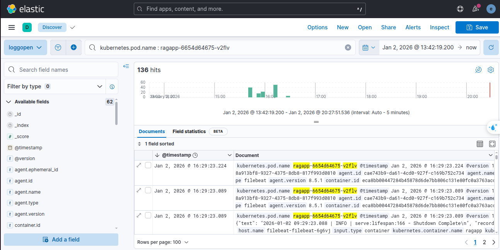
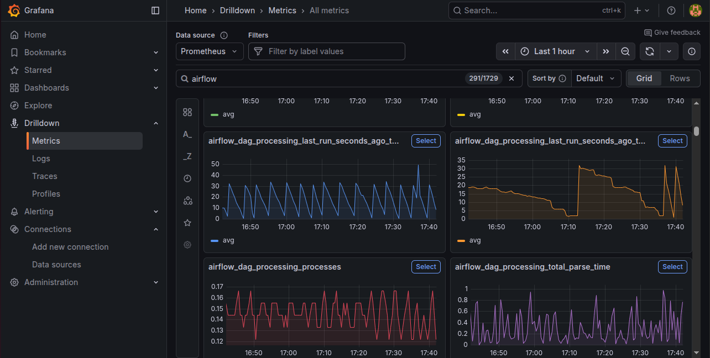
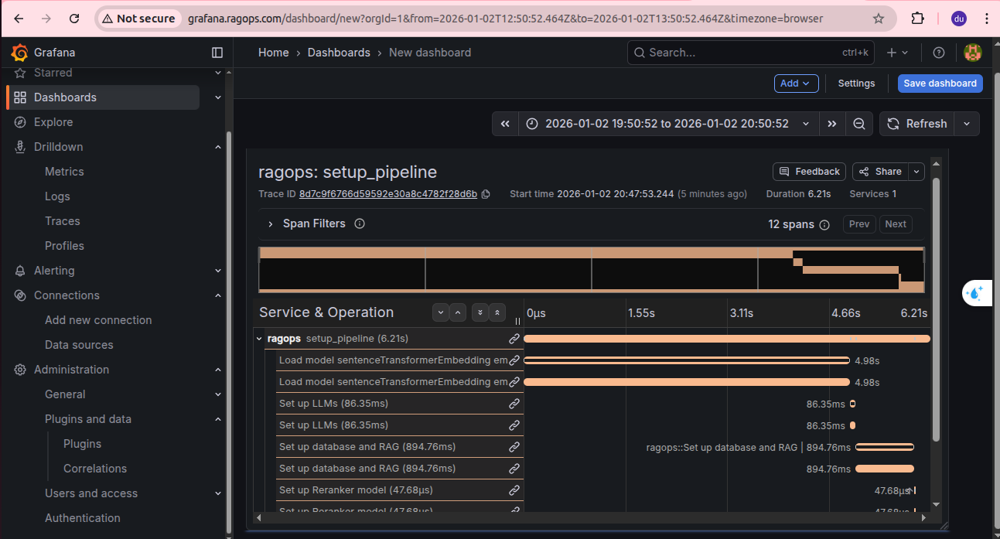
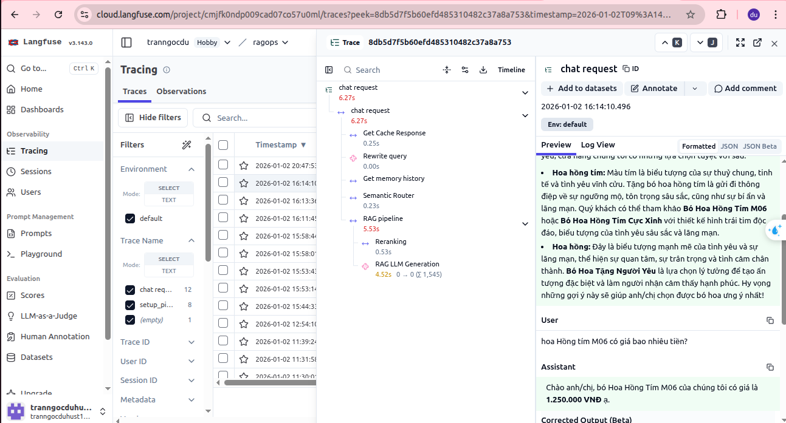

# RAGOps

An intelligent Agentic RAG-powered chatbot for flower shop customer support.

## Introduction

**RAGOps** is an intelligent chatbot assistant built on the **Agentic Retrieval-Augmented Generation (Agentic RAG)** architecture, specifically designed to provide consultation and answer customer inquiries about flowers and related products sold in the store.

The system leverages an advanced Agentic RAG mechanism, enabling dynamic and intelligent orchestration of the retrieval and generation pipeline. Key modules include:

- **Prompt Cache**: Stores and reuses prompts to optimize performance.
- **Memory**: Manages conversation history and long-term context.
- **Query Rewrite**: Rewrites user queries to improve retrieval accuracy.
- **Retrieval**: Fetches relevant information from the knowledge base.
- **Smart Router**: Intelligently routes requests to appropriate data sources or modules.
- **Rerank**: Re-ranks retrieved documents to prioritize the highest-quality results.
- **Generation**: Generates natural, contextually enriched responses.
- **Chat History**: Tracks and integrates conversation history for continuity.

The application follows **RAGOps/LLMOps** best practices, emphasizing reliable production operations, scalability, and comprehensive observability. It is deployed on Google Cloud Platform, utilizing **Google Kubernetes Engine (GKE)** for container orchestration and **Google Compute Engine (GCE)** for supplementary resources.

### System Components

The main components of the system include:

1. **Ragapp**  
   The core orchestration service handling the full RAG pipeline and user requests.

2. **Airflow**  
   Manage data ingestion workflows, perform database updates periodically or manually. Create snapshots on Google cloud storage for rollback.

3. **Prometheus + Grafana**  
   Monitors resource utilization and performance of the GKE cluster.

4. **ELK Stack** (Elasticsearch, Logstash, Kibana)  
   Collects, stores, and visualizes logs for debugging and troubleshooting.

5. **OpenTelemetry + OTel Collector + Tempo**  
   Provides distributed tracing for end-to-end request visibility.

6. **Langfuse**  
   Tracks LLM traces, evaluates response quality, and monitors model usage costs.

7. **Evidently**  
   Detects data drift and monitors input data quality.

8. **MLflow**  
   Handles experiment logging and model versioning during embedding model fine-tuning.

9. **BentoML Services**  
   Deploys embedding and reranking models with batching support to maximize throughput and enable horizontal scaling.

10. **Jenkins**  
    Automates the CI/CD pipeline for fast and safe deployments.


## Features

- Agentic RAG pipeline with advanced routing and reranking
- Full observability stack (metrics, logs, traces)
- Production-grade MLOps and LLMOps tooling
- Scalable deployment on Google Cloud (GKE + GCE)

## Architecture

<div align="center">



*Figure 1: RAGOps System Architecture Overview*  

</div>

## Demo Screenshots
### ChatUI Demo(Open WebUI)
<div align="center">



*Figure 2: Demo chatUI*

</div>

### Grafana Dashboard (Monitoring & Metrics)
<div align="center">



*Figure 3: Grafana dashboard*

</div>

### ELK stack Dashboard (Logging)
<div align="center">



*Figure 4: ELK stack dashboard*

</div>

### Airflow web UI (Data Ingestion)
<div align="center">


*Figure 5: Airflow web UI*

</div>

### Airflow resource (Statsd + Statsd Exporter + Prometheus + Grafana)
<div align="center">



*Figure 6: Airflow resource*

</div>

### Trace dashboard (Otlp + otel collector + tempo + Grafana)
<div align="center">



*Figure 7: Trace dashboard*

</div>

### Langfuse dashboard 
<div align="center">



*Figure 7: Langfuse dashboard*

</div>


## Deployment Guide

This section provides step-by-step instructions to deploy the full RAGOps system on Google Cloud Platform using **Google Kubernetes Engine (GKE)** and **Google Compute Engine (GCE)**.

> **Prerequisites**
> - Google Cloud project with billing enabled
> - `gcloud` CLI configured and authenticated
> - `kubectl` configured to access your GKE cluster
> - Helm 3 installed
> - Terraform installed
> - Skaffold (optional, for local development/debugging)

### 1. Provision Infrastructure with Terraform

#### 1.1 Create GKE Cluster and Supporting Resources
```bash
cd iac/terraform
terraform init
terraform plan
terraform apply
```

#### 1.2 (Optional) Provision Airflow on Compute Engine
```Bash
cd iac/airflow
terraform init
terraform plan
terraform apply
```

### 2. Deploy Core Components to GKE

#### 2.1 Install ingress-nginx Controller

```
kubectl create namespace ingress-nginx
kubens ingress-nginx

helm upgrade --install ingress-nginx ./deployments/ingress-nginx \
  --namespace ingress-nginx
```

#### 2.2 Deploy Redis
```
kubectl create namespace redis 
kubens redis

helm upgrade --install redis ./deployments/redis \
  --namespace redis
```
To retrieve the Redis password:
```
kubectl get secret redis -n redis -o jsonpath='{.data.redis-password}' | base64 -d
```

#### 2.3 Create Application Secrets

```
kubectl create namespace serving
kubens serving

kubectl apply -f deployments/ragapp-secret.yaml
```

#### 2.4 Deploy ChromaDB
```
helm upgrade --install chromadb ./deployments/chromadb \
  --namespace serving
```

#### 2.5 Deploy Embedding and Reranking Services (BentoML)
```
helm upgrade --install embeddings ./deployments/embeddings \
  --namespace serving

helm upgrade --install reranking ./deployments/reranking \
  --namespace serving
```
#### 2.6 Deploy Ragapp (Main Application)
```
helm upgrade --install ragops ./deployments/ragapp \
  --namespace serving
```
For local development and debugging on GKE:
```
skaffold dev --verbosity=info
```
#### 2.7 Deploy Open WebUI (Optional Chat Interface)
```
helm upgrade --install open-webui ./deployments/open-webui \
  --namespace serving
```

### 3. Deploy Observability Stack
#### 3.1 Deploy kube-prometheus-stack (Metrics & Alerts)
```
kubectl create namespace monitoring 
kubens monitoring

helm upgrade --install kube-prometheus-stack \
  -f deployments/kube-prometheus-stack/values-custom.yaml \
  ./deployments/kube-prometheus-stack \
  --namespace monitoring
```

Enable Gmail alerts (optional):
```
kubectl create secret generic gmail-auth \
  --from-literal=password='your-gmail-app-password' \
  -n monitoring

kubectl apply -f deployments/prometheus_rule.yaml
kubectl apply -f deployments/alert_config.yaml
```

Grafana Access credentials:
* username: admin
* password: prom-operator


#### 3.2 Deploy Distributed Tracing (OpenTelemetry + Tempo)

```
# Create service account and grant storage access
gcloud iam service-accounts create tempo-sa

gsutil iam ch serviceAccount:tempo-sa@<PROJECT_ID>.iam.gserviceaccount.com:objectAdmin gs://tempo-traces-bucket-grafana

# Deploy collector
helm upgrade --install opentelemetry-collector \
  -f deployments/opentelemetry-collector/otel-collector-values.yaml \
  ./deployments/opentelemetry-collector \
  --namespace monitoring

# Deploy Tempo
helm upgrade --install tempo \
  -f deployments/tempo/tempo-values.yaml \
  ./deployments/tempo \
  --namespace monitoring

```

### 4. Deploy Logging Stack (ELK)
```
kubectl create namespace logging --dry-run=client -o yaml | kubectl apply -f -
kubectl config set-context --current --namespace=logging

helm upgrade --install elasticsearch \
  -f deployments/ELK/values-elasticsearch.yaml \
  ./deployments/ELK/elasticsearch \
  --namespace logging

helm upgrade --install logstash \
  -f deployments/ELK/values-logstash.yaml \
  ./deployments/ELK/logstash \
  --namespace logging

helm upgrade --install kibana \
  -f deployments/ELK/values-kibana.yaml \
  ./deployments/ELK/kibana \
  --namespace logging

helm upgrade --install filebeat \
  -f deployments/ELK/values-filebeat.yaml \
  ./deployments/ELK/filebeat \
  --namespace logging

```
Kibana Access credentials
Default credentials:
* Username: elastic
* Password:
```
kubectl get secret elasticsearch-master-credentials -n logging \
  -o jsonpath='{.data.password}' | base64 -d
```

### 5. Deploy Apache Airflow (Data Ingestion)
After provisioning the VM via Terraform (step 1.2):

#### 1. SSH into the Airflow VM
#### 2. Run the setup script:
```
git clone https://github.com/tranngocduvnvp/airflow-gcp.git
cd airflow-gcp
chmod +x ./install_airflow.sh
bash ./install_airflow.sh
```
Airflow UI will be available at http://<vm-external-ip>:8080
#### 3. Start the product ingestion trigger:
```
python main.py
```
Trigger app will be available at http://<vm-external-ip>:8686

## Cleanup (Optional)
To destroy resources:
```
# GKE resources
cd iac/terraform && terraform destroy

# Airflow VM
cd iac/airflow && terraform destroy
```

## Acknowledgments

This project uses data and a small portion of the codebase from the open-source repository [quang-le-vietnamese-rag](https://github.com/ProtonX-AI-for-Devs-01/quang-le-vietnamese-rag).

We are grateful to the original authors and the ProtonX team for making their work publicly available on GitHub. It has served as a valuable foundation and inspiration for our implementation.

## Contributing

Contributions are welcome! 


